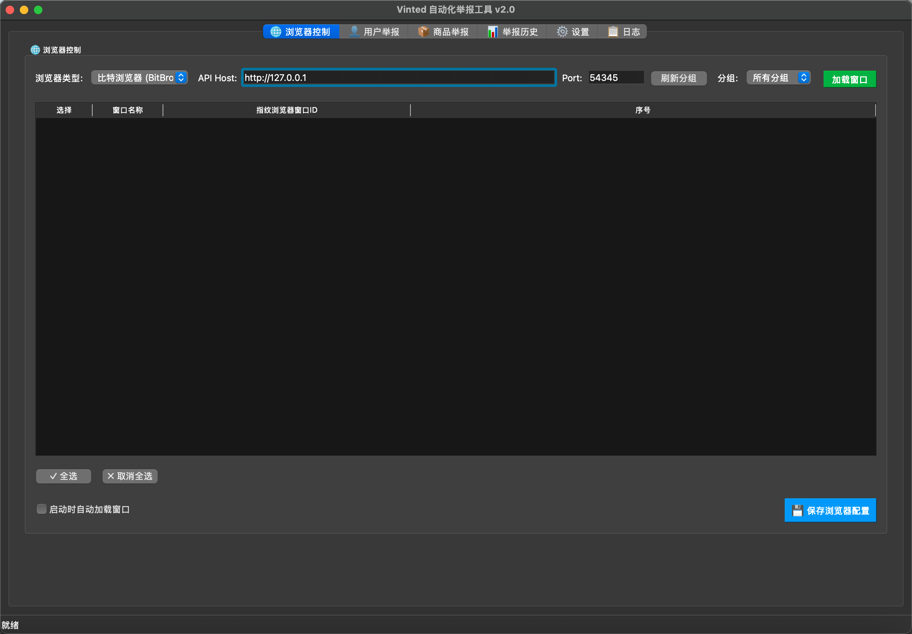
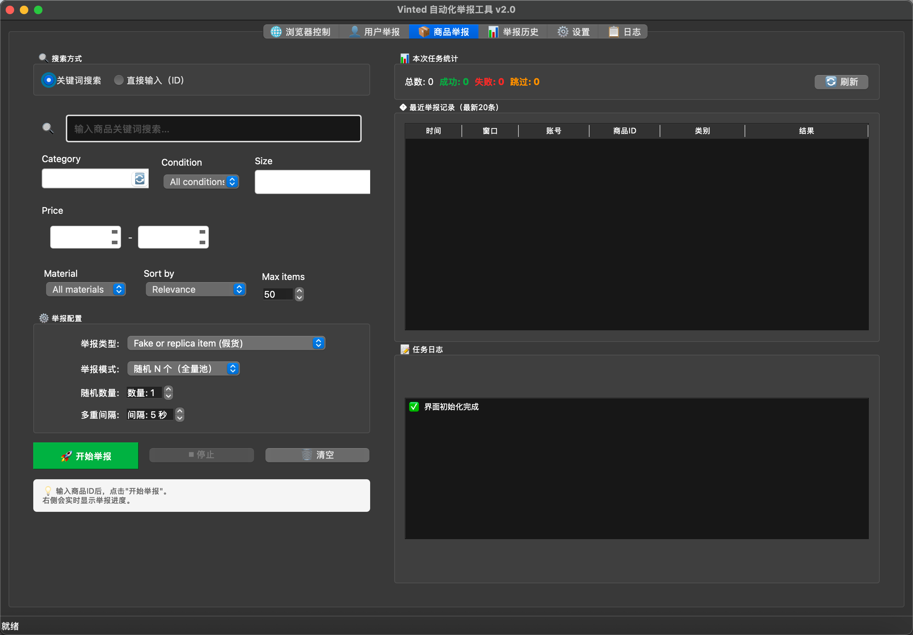
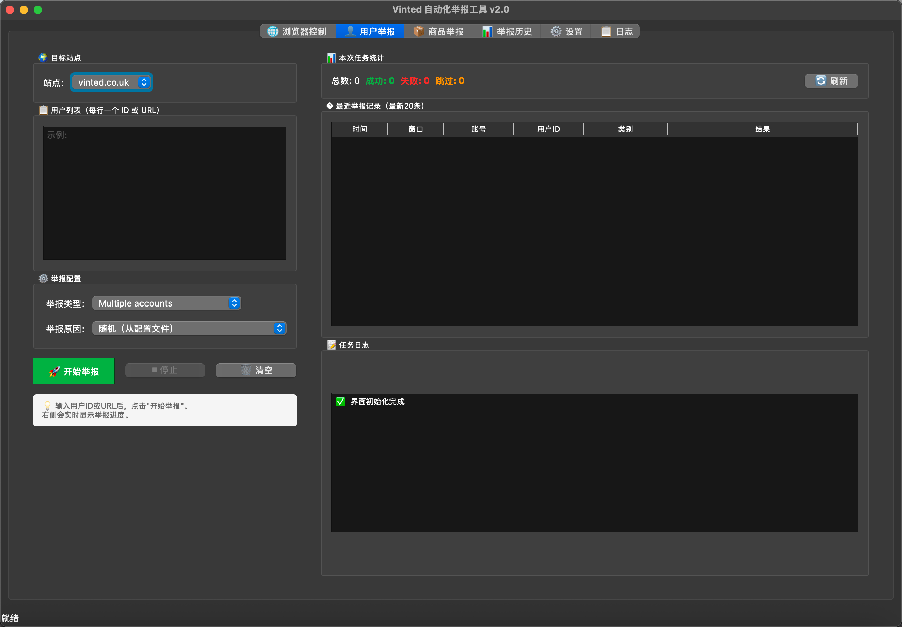
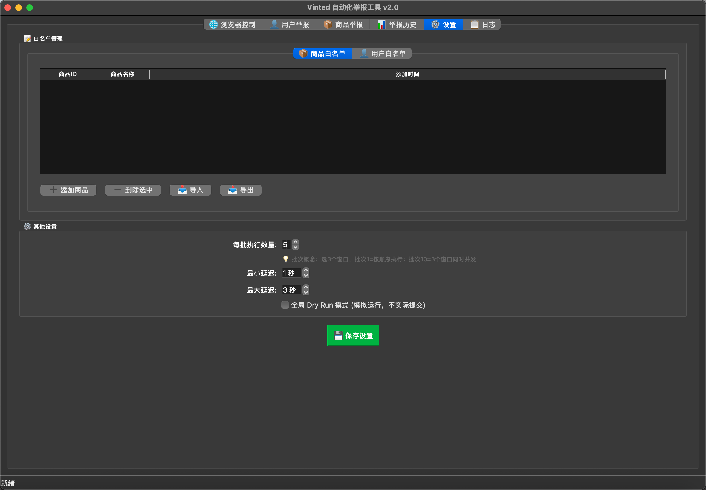

# Vinted 举报工具 - 用户使用说明

## 📖 目录

1. [快速开始](#快速开始)
2. [浏览器配置](#浏览器配置)
3. [商品举报](#商品举报)
4. [用户举报](#用户举报)
5. [举报历史](#举报历史)
6. [白名单管理](#白名单管理)
7. [系统设置](#系统设置)
8. [常见问题](#常见问题)

---

## 快速开始

### 首次启动

1. **macOS 用户**
   - 解压 `Vinted举报工具-macOS.zip`
   - 右键点击 `Vinted举报工具.app` → 选择"打开"
   - 如果提示"无法验证开发者"，再次右键 → "打开" → 点击"打开"

2. **Windows 用户**
   - 解压 `Vinted举报工具-Windows-x64.zip`
   - 进入 `Vinted举报工具` 文件夹
   - 双击 `Vinted举报工具.exe`
   - 如果提示安全警告，点击"更多信息" → "仍要运行"

### 主界面介绍

应用程序主界面包含以下几个部分：

- **顶部**：浏览器控制面板
- **左侧**：功能导航标签
  - 📦 商品举报
  - 👤 用户举报
  - 📊 举报历史
  - ⚙️ 设置
- **中间**：主要操作区域
- **底部**：日志输出窗口

---

## 浏览器配置

### 配置步骤

#### 1. 选择浏览器类型

在顶部下拉菜单中选择您使用的指纹浏览器：
- **BitBrowser**（比特浏览器）
- **Hubstudio**
- **AdsPower**
- **Multilogin**

#### 2. 配置 API 地址

**BitBrowser 默认配置：**
- API Host: `http://127.0.0.1`
- API Port: `54345`

**Hubstudio 默认配置：**
- API Host: `http://127.0.0.1`
- API Port: `6873`
- 需要额外填写：
  - App ID
  - App Secret
  - Group Code

#### 3. 保存配置

点击 **"💾 保存浏览器配置"** 按钮，配置会保存到数据库，下次启动自动加载。

#### 4. 加载窗口

点击 **"🔄 加载窗口"** 按钮，系统会：
1. 连接到浏览器 API
2. 获取所有可用的浏览器窗口
3. 显示在窗口列表中

**窗口列表说明：**
- ✅ 勾选框：选择要使用的窗口
- 窗口ID：浏览器窗口的唯一标识
- 名称：窗口的名称
- 状态：窗口当前状态（运行中/已停止）
- Vinted用户：如果已登录 Vinted，会显示用户信息

#### 5. 自动加载设置

勾选 **"启动时自动加载窗口"**，下次启动应用时会自动加载窗口列表。

---

## 商品举报

### 功能说明

用于批量举报 Vinted 平台上的商品。

### 操作步骤

#### 1. 输入商品信息

在 **"商品ID/URL"** 输入框中输入：
- **商品ID**：例如 `4123456789`
- **商品URL**：例如 `https://www.vinted.fr/items/4123456789`

**支持批量输入**：
- 每行一个商品ID或URL
- 自动识别格式
- 自动去重

#### 2. 选择举报策略

系统支持三种举报策略：
- **单次举报**：随机选择一个举报类别和原因
- **顺序全量举报**：按顺序使用所有可用的举报类别
- **随机 N 次举报**：随机选择 N 个不同的举报类别

**注意**：举报类别和原因由系统自动随机选择，无需手动指定。这样可以：
- 模拟真实用户行为
- 避免举报模式被识别
- 提高举报成功率

#### 3. 开始举报

点击 **"🚀 开始举报"** 按钮：
- 系统会自动检查是否已举报过（防重复）
- 使用选中的浏览器窗口进行举报
- 多线程并发执行
- 实时显示进度和结果

### 举报进度

底部日志窗口会实时显示：
- ✅ 举报成功
- ❌ 举报失败（含原因）
- ⏭️ 已跳过（已举报过或在白名单中）

---

## 用户举报

### 功能说明

用于批量举报 Vinted 平台上的用户账号。

### 操作步骤

#### 1. 输入用户信息

在 **"用户ID/URL"** 输入框中输入：
- **用户ID**：例如 `12345678`
- **用户URL**：例如 `https://www.vinted.fr/member/12345678`

**支持批量输入**：
- 每行一个用户ID或URL
- 自动识别格式
- 自动去重

#### 2. 选择搜索方式（可选）

- **关联用户搜索**：搜索该用户的商品，然后举报相关用户
- **直接输入（ID）**：直接举报指定的用户

#### 3. 设置筛选条件（可选）

如果选择"关联用户搜索"，可以设置：
- **商品类别**：筛选特定类别的商品
- **价格范围**：设置最低和最高售价
- **商品状态**：新品、二手等

#### 4. 开始举报

点击 **"🚀 开始举报"** 按钮：
- 系统会自动选择合适的举报类别和原因
- 使用选中的浏览器窗口进行举报
- 多线程并发执行
- 实时显示进度和结果

---

## 举报历史

### 功能说明

查看所有历史举报记录，支持筛选和导出。

### 界面说明

#### 筛选功能

- **窗口ID筛选**：选择特定浏览器窗口的举报记录
- **目标类型筛选**：
  - 全部
  - 商品
  - 用户

#### 举报记录表格

显示以下信息：
- **举报时间**：举报的具体时间
- **浏览器类型**：使用的浏览器（BitBrowser/Hubstudio等）
- **窗口ID**：使用的浏览器窗口
- **Vinted用户**：执行举报的 Vinted 账号
- **目标类型**：商品或用户
- **目标ID**：被举报的商品/用户ID
- **目标名称**：商品/用户名称
- **举报类别**：选择的举报类别
- **状态**：成功/失败
- **错误信息**：如果失败，显示原因

#### 导出功能

点击 **"📊 导出Excel"** 按钮：
- 导出当前筛选的所有记录
- 生成 Excel 文件
- 包含所有字段信息
- 文件名格式：`举报历史_YYYYMMDD_HHMMSS.xlsx`

---

## 白名单管理

### 功能说明

管理商品和用户白名单，白名单中的项目不会被举报。

### 商品白名单

#### 添加商品

1. 点击 **"➕ 添加商品"** 按钮
2. 输入商品ID
3. 输入商品名称（可选）
4. 点击确定

#### 删除商品

1. 在列表中选中要删除的商品
2. 点击 **"➖ 删除选中"** 按钮

#### 导入商品

1. 点击 **"📥 导入"** 按钮
2. 选择文件：
   - **Excel 文件**（推荐）：使用 `data/商品白名单模板.xlsx`
   - **文本文件**：格式 `商品ID,商品名称`（每行一个）
3. 系统自动导入并去重

#### 导出商品

点击 **"📤 导出"** 按钮，导出当前所有商品白名单。

### 用户白名单

操作方式与商品白名单相同：
- ➕ 添加用户
- ➖ 删除选中
- 📥 导入（使用 `data/用户白名单模板.xlsx`）
- 📤 导出

---

## 系统设置

### 举报配置

#### 并发线程数

- **说明**：同时运行的举报任务数量
- **范围**：1-10
- **推荐**：3-5
- **注意**：过高可能导致浏览器负载过大

#### 延迟设置

**最小延迟（秒）**：
- 每次举报之间的最小等待时间
- 推荐：2-3秒

**最大延迟（秒）**：
- 每次举报之间的最大等待时间
- 推荐：5-8秒

**说明**：系统会在最小和最大延迟之间随机选择，模拟人工操作。

#### Dry Run 模式

- **启用**：测试模式，不实际提交举报
- **用途**：测试配置、检查流程
- **日志**：会显示"[DRY RUN]"标记

### 保存设置

点击 **"💾 保存设置"** 按钮，所有配置会保存到数据库。

---

## 常见问题

### 1. 窗口加载失败

**问题**：点击"加载窗口"后没有显示窗口列表

**解决方案**：
1. 检查浏览器是否正在运行
2. 确认 API 地址和端口是否正确
3. BitBrowser：确保本地 API 已启用
4. Hubstudio：确保使用命令行模式启动，并填写正确的认证信息

### 2. 无法获取用户信息

**问题**：窗口列表中"Vinted用户"显示为空

**解决方案**：
1. 确保浏览器窗口已登录 Vinted
2. 访问 Vinted 主页
3. 刷新浏览器
4. 重新点击"加载窗口"

### 3. 举报失败

**问题**：举报时显示"❌ 未找到任何提交按钮"

**解决方案**：
1. 检查网络连接
2. 确认 Vinted 账号状态正常
3. 检查商品/用户ID是否正确
4. 查看日志获取详细错误信息

### 4. 数据库错误

**问题**：启动时提示数据库错误

**解决方案**：
1. 关闭所有应用程序实例
2. 删除 `data/vinted_reports.db` 文件
3. 重新启动应用（会自动创建新数据库）

### 5. macOS 安全提示

**问题**：macOS 提示"无法打开，因为无法验证开发者"

**解决方案**：
1. 右键点击应用 → 选择"打开"
2. 在弹出的对话框中点击"打开"
3. 或者在"系统偏好设置" → "安全性与隐私"中允许

### 6. Windows 安全警告

**问题**：Windows 提示"Windows 已保护你的电脑"

**解决方案**：
1. 点击"更多信息"
2. 点击"仍要运行"

---

## 💡 使用技巧

### 1. 批量举报

- 可以一次性输入多个商品/用户ID
- 每行一个，系统会自动处理
- 自动去重，避免重复举报

### 2. 防重复举报

- 系统会自动记录所有举报历史
- 举报前会检查是否已举报过
- 如果已举报，会自动跳过

### 3. 白名单使用

- 将重要的商品/用户添加到白名单
- 举报时会自动跳过白名单中的项目
- 支持批量导入

### 4. 多账号管理

- 可以同时使用多个浏览器窗口
- 每个窗口对应一个 Vinted 账号
- 系统会自动分配任务到不同窗口

### 5. 日志查看

- 底部日志窗口实时显示操作状态
- 可以滚动查看历史日志
- 复制日志内容用于问题排查

---

## 📞 技术支持

如有问题，请：
1. 查看日志输出
2. 检查 `data/vinted_reports.db` 数据库
3. 查看详细文档：`docs/功能更新总结-v2.0.md`

---

**版本**: v1.0.0  
**更新日期**: 2026-02-10
